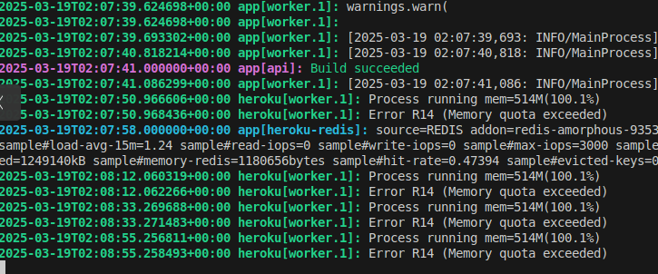
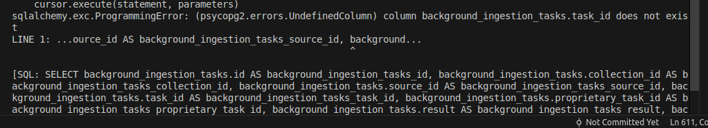
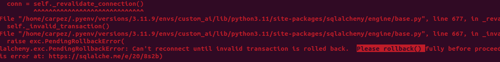
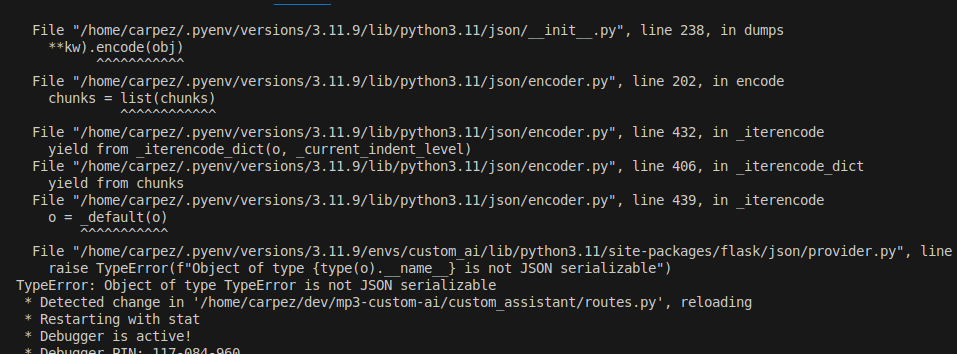

## BUGS

### Heroku out of memory


I had a problem with the import and the worker was loading all the app.... Created the worker own module.

### Missing Migration


Stupid mistake, but when you forget adding a field and everything stop working....

```bash
flask db migrate -m "commit"
flask db upgrade
```

### PendingRollback


```python
except PendingRollbackError:
    db.session.rollback()
    db.session.close()
```

### Streaming error


Added disable_streaming=True to the ChatOllama instance

### Homepage carousel
On mobile is not responsive and it looks awful, but i don't have any more time so I'll leave it as it is.

### Sometimes logs user out
Not yet found reason.

### Long wait when sending a message
Added a spinner to the sends message button and disabling it until data is fetched.

### Not saving tables and images when extracting pdfs
In storage.py I was checking for "jpg" <code>not in ALLOWED_EXTENSION</code>
Removed the not.