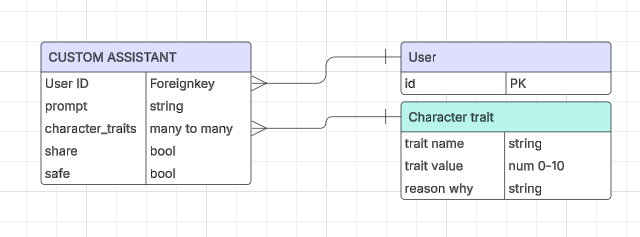

# Custom AI

## Concept
The idea is to let each user create and share if they want, their own AI assistant, each with different personalities and trait affecting their characters.
To be able to do this I'll have to work with "abliterated" models (more later), so we'll make sure users won't incur in using one public but "unsafe" model capable of talking about difficult topics, we will label them as NSFW.

## UX
The platform targets any person who wants to play with a completely unrestrictred and customizable AI chatbot.
The application is designed to distinguish its users in:
 - UNREGISTERED USERS: They will be able to chat with anything they create in the playground by mixing base prompt and character traits without being able to save.
 - REGISTERED USERS: They will be able to create, modify, save their own assistants, their character traits and their chat histories.

[MODEL USED](https://huggingface.co/DavidAU/Llama-3.2-8X3B-MOE-Dark-Champion-Instruct-uncensored-abliterated-18.4B-GGUF)

### User Stories
 - As an UNREGISTERED USER I'd like to be able to try the platform.
 - As an UNREGISTERED USER I'd like to be able to register easily.
 - As a REGISTERED USER I'd like to create unique assistants.
 - As a REGISTERED USER I'd like to be able to modify my assistants.
 - As a REGISTERED USER I'd like to be able to save my chat histories.
 - As a REGISTERED USER I'd like to be able to share my assistants and try other's.
 - As a REGISTERED USER I'd like to be able to delete my assistants and/or my account.

### Strategy
The goal of this project is to create a fully customizable assistant with a definite personality created assembling the base prompt and character traits choosen by the user.



## V1 Features
 - Fully customizable AI chatbot/assistant 

## Future Features
 - RAG from shared knowledge among users
 - Shareable Flows

## Development

### Local Machine
Intel Core i7 13700k 32GB DDR5 - RX7800XT 16GB
Ubuntu 22.04.05.

#### Python Environment
 - pyenv 2.5.3 - [How to install pyenv on Ubuntu 22.04](https://ericsysmin.com/2024/01/11/how-to-install-pyenv-on-ubuntu-22-04/)
 - python 3.11.9
 - celery

#### Inference Environment
 - ROCM 6.3.4
```bash
sudo apt update
wget https://repo.radeon.com/amdgpu-install/6.3.4/ubuntu/jammy/amdgpu-install_6.3.60304-1_all.deb
sudo apt install ./amdgpu-install_6.3.60304-1_all.deb
sudo amdgpu-install -y --usecase=graphics,rocm
sudo usermod -a -G render,video $LOGNAME
echo "export HSA_OVERRIDE_GFX_VERSION=11.0.0" >> .profile
```
Followed [this](https://discuss.linuxcontainers.org/t/rocm-and-pytorch-on-amd-apu-or-gpu-ai/19743) tutorial with no incus but with up to date drivers (released 6th March 2025)
 - ollama - [Download Ollama](https://ollama.com/download)

#### Local Redis Server for background tasks
 - [REDIS SERVER](https://redis.io/docs/latest/operate/oss_and_stack/install/install-redis/install-redis-on-linux/)


### Deployment

#### Heroku

 - requirements.txt
From command line:
```bash
pip install pip-tools
pip-compile requirements/requirements.in -o requirements.txt
```
The created requirements.txt file will tell the heroku platform which packages to install.

- Procfile
   Create a new file named Procfile with the following code in it
```bash
web: gunicorn app:app
worker: celery -A custom_assistant.tasks worker --loglevel=INFO
```
It will tell the heroku platform to launch the web application and the celery worker to run background tasks.

- .python-version
Create a file named .python-version with the python version the app is using.
```bash
3.11
```
It will tell the heroku platform which python version to use.


