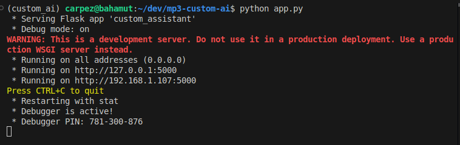
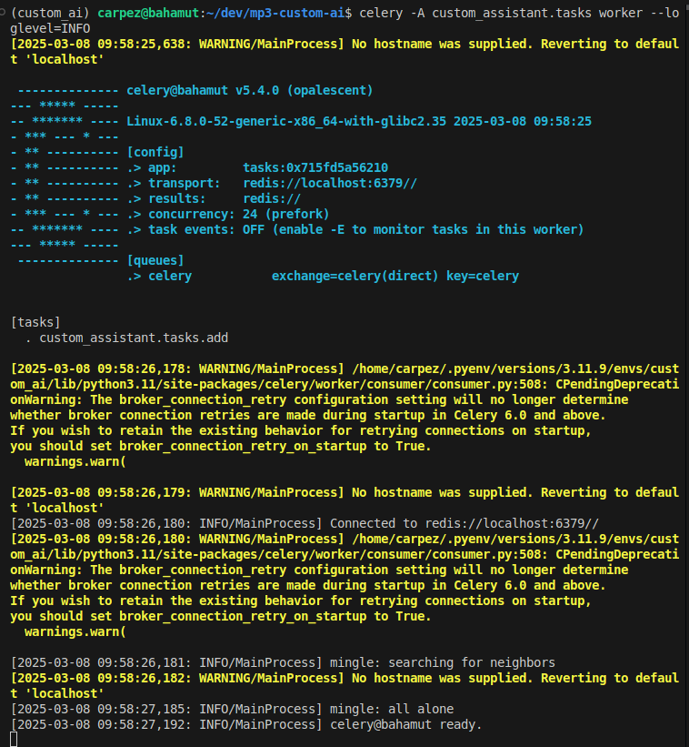
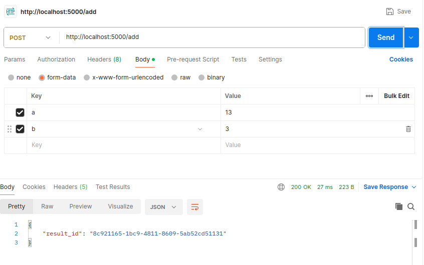
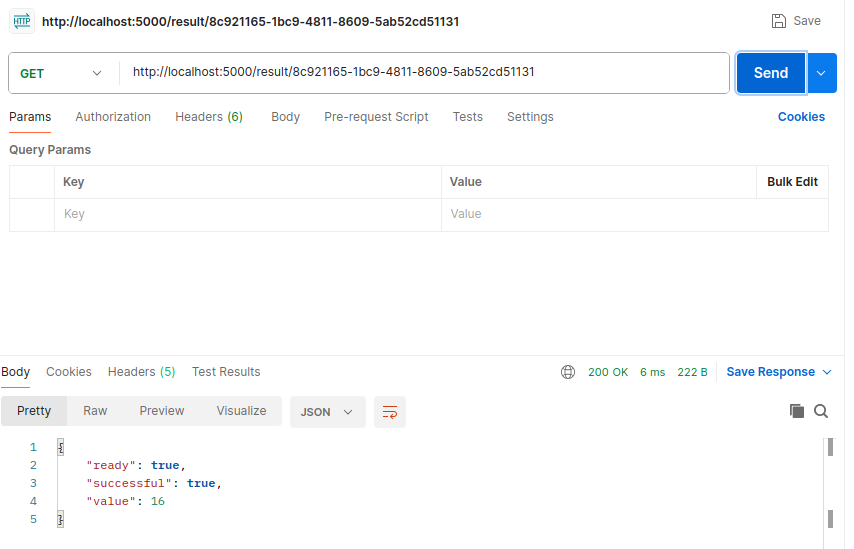
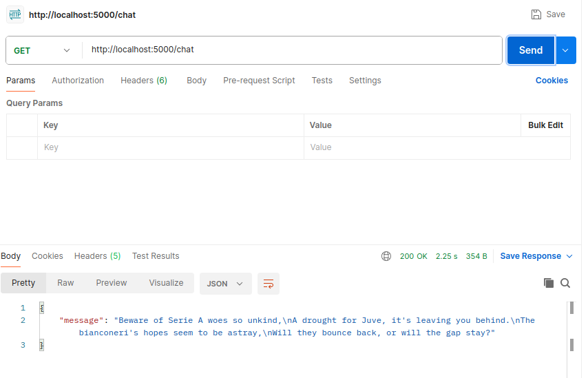
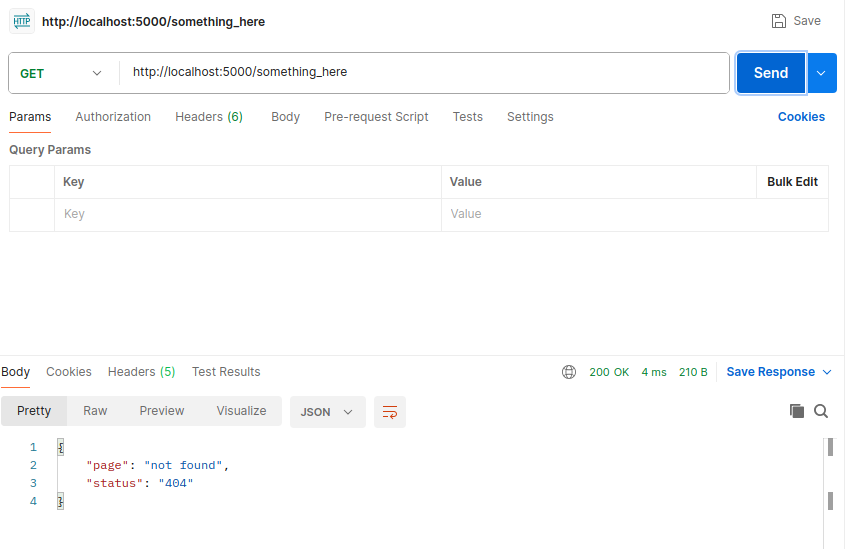

## Testing local environment
In two different shells:
 - ```bash
    python app.py
    ```
    
 - ```bash
    celery -A custom_assistant.tasks worker --loglevel=INFO
    ```
    

I used Postman to test the routes and see if everything it's working:
 - Test add route. It should return a unique id for the task processing in background.
    
 - Test task_result route. It should return the status and result for a given task id
    
 - Test chat route. It should return a small poem about Juventus not doing so well. Sigh!
    
 - Test 404 route. It should return a dict with status 404 and page not found.
    