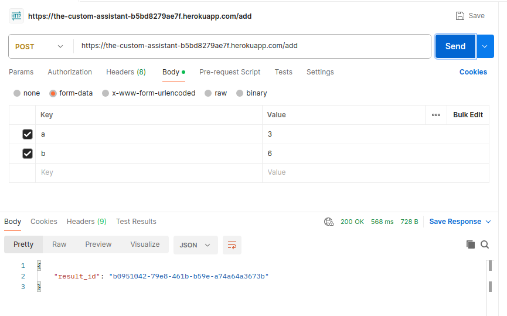
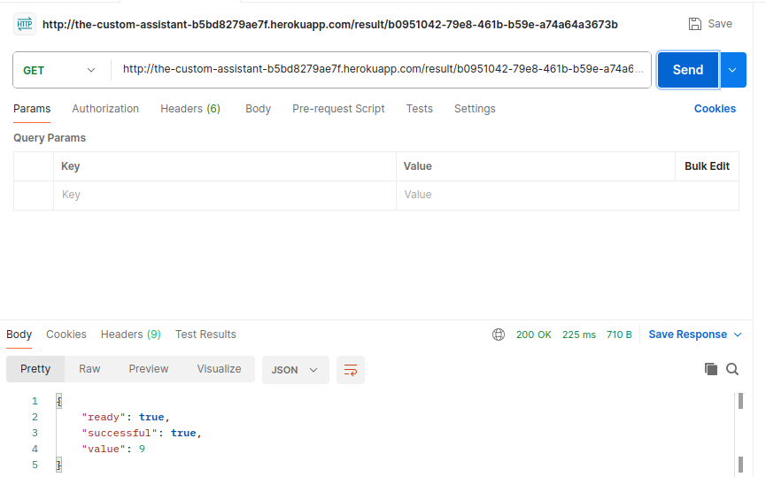
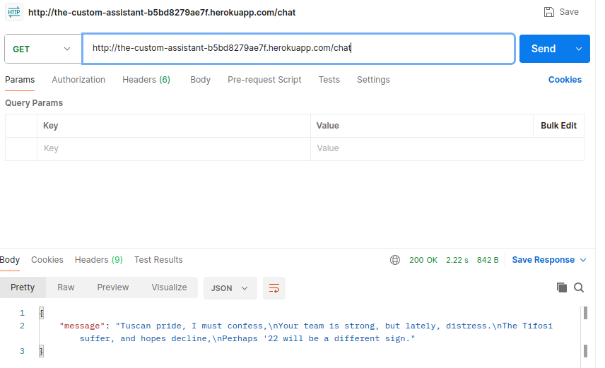
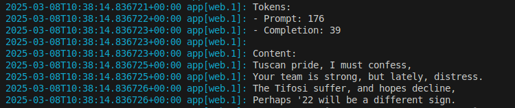

## Testing local environment
In two different shells:
 - ```bash
    python app.py
    ```
    
 - ```bash
    celery -A custom_assistant.tasks worker --loglevel=INFO
    ```
    

I used Postman to test the routes and see if everything it's working:
 - Test add route. It should return a unique id for the task processing in background.
    
 - Test task_result route. It should return the status and result for a given task id
    
 - Test chat route. It should return a small poem about Juventus not doing so well. Sigh!
    
 - Test 404 route. It should return a dict with status 404 and page not found.
    

## Testing Heroku environment
Using Postman:
 - Test add route.
    
 - Test task_result route.
    
 - Test chat route.
    
    
 - Test 404 route.
    

### User Authentication
| Action                           | Expected Result                             | Actual Result                                   | Correct |
| -------------------------------- | ------------------------------------------- | ----------------------------------------------- | ------- |
| Login with google                | Login or register if not already            | Login or register if not already<br>            | YES     |
| Login with correct credentials   | Login if verified else email                | Login if verified else email                    | YES     |
| Login with incorrect credentials | Error                                       | Error                                           | YES     |
| Register with google             | Register and Login                          | Register and Login                              | YES     |
| Register with credentials        | Register if email is not present and email  | Register if email is not present and email      | YES     |
| Forgot Password                  | Link via email                              | Link via email                                  | YES     |
| Change password from forgot      | Change the password                         | Change the password                             | YES     |
| Change password from profile     | Change the password with old one if correct | Change the password with the old one if correct | YES     |

### Playground
| Action                | Expected Result                             | Actual Result                               | Correct |
| --------------------- | ------------------------------------------- | ------------------------------------------- | ------- |
| Add trait <br>        | Open modal                                  | Open modal                                  | YES     |
| Add new trait         | Add new trait                               | Add new trait                               | YES     |
| Clear                 | Resets everything to none                   | Resets everything to none                   | YES     |
| Send message          | Send and retrieve a message and token usage | Send and retrieve a message and token usage | YES     |
| Save active assistant | Save active assistants and traits           | Save active assistant and traits            | YES     |

### Assistants
| Action                  | Expected Result                                             | Actual Result                                               | Correct |
| ----------------------- | ----------------------------------------------------------- | ----------------------------------------------------------- | ------- |
| Select Assistant        | Retrieve the assistant info, and setup the page elements    | Retrieve the assistant info and setup the page elements     | YES     |
| Delete                  | Open modal for confirmation                                 | Open modal for confirmation                                 | YES     |
| Edit                    | Enable Save, disable itself, hide delete, clear appear      | Enable Save, disable itself, hide delete, clear appear      | YES     |
| Clear                   | As after the assistant was retrieved the last time          | As after the assistant was retrieved the last time          | YES     |
| Save                    | Save the assistant                                          | Save the assistant                                          | YES     |
| Manage traits           | Open offcanvas                                              | Open offcanvas                                              | YES     |
| Trait Accordion         | Open the relative trait                                     | Open the relative trait                                     | YES     |
| Trait Edit              | Edit disabled Save enabled                                  | Edit disabled Save enabled                                  | YES     |
| Trait Save              | Save the trait after edited                                 | Save the trait after edited                                 | YES     |
| Delete trait            | Delete the trait                                            | Delete the trait                                            | YES     |
| Add to active assistant | Add the trait to the assistant if selected, error otherwise | Add the trait to the assistant if selected, error otherwise | YES     |
| Add new trait           | Add a new trait                                             | Add a new trait                                             | YES     |

### Chat histories
| Action                  | Expected Result                                             | Actual Result                                               | Correct |
| ----------------------- | ----------------------------------------------------------- | ----------------------------------------------------------- | ------- |
| Go to a chat history    | Go to the chat history page                                 | Go to the chat history page                                 | YES     |
| Delete a chat history   | Open modal for confirmation                                 | Open modal for confirmation                                 | YES     |
| Delete confirmation     | Delete the chat history                                     | Delete the chat history                                     | YES     |

### Chat history
| Action                       | Expected Result                                             | Actual Result                                               | Correct |
| ---------------------------- | ----------------------------------------------------------- | ----------------------------------------------------------- | ------- |
| Send a message               | Continue with the chat history                              | Continue with the chat history                              | YES     |
| Save the chat history        | Save the chat history                                       | Save the chat history                                       | YES     |

### Collections
| Action                   | Expected Result                                          | Actual Result                                            | Correct |
| ------------------------ | -------------------------------------------------------- | -------------------------------------------------------- | ------- |
| Get collection           | Retrieve the collection info and setup the page elements | Retrieve the collection info and setup the page elements | YES     |
| Delete                   | Open delete confirmation modal                           | Open delete confirmation modal                           | YES     |
| Edit                     | Switch Delete/Clear, Edit disabled and Save enabled      | Switch Delete/Clear, Edit disabled and Save enabled      | YES     |
| Clear                    | As after the last collection retrieval                   | As after the last collection retrieval                   | YES     |
| Save                     | Save the collection                                      | Save the collection                                      | YES     |
| Send message             | Query the vectorstore for the given collection           | Query the vectorstore for the given collection           | YES     |
| Manage source            | Open the offcanvas for source management                 | Open the offcanvas for source management                 | YES     |
| Delete Source            | Delete the source if is not ingested in any Collection   | Delete the source if is not ingested in any Collection   | YES     |
| Upload new source        | Upload a new document                                    | Upload a new document                                    | YES     |
| Add source to collection | Start the background ingestion process                   | Start the background ingestion process                   | YES     |

### Background Ingestion Process
| Action                                           | Expected Result                                                                            | Actual Result                                                                              | Correct |
| ------------------------------------------------ | ------------------------------------------------------------------------------------------ | ------------------------------------------------------------------------------------------ | ------- |
| Send post request to proprietary hardware server | If server is up pass the ingestion task, otherwise activate a celery worker to retry later | If server is up pass the ingestion task, otherwise activate a celery worker to retry later | YES     |
| Delayed request to proprietary hardware server   | Server is down celery worker goes on a loop until server is back up                        | Server is down celery worker goes on a loop until server is back up                        | YES     |
| Server Up                                        | Celery worker start delayed tasks                                                          | Celery worker start delayed tasks                                                          | YES     |
| Extract elements from pdf                        | Extract text in chunks, images and tables from the pdf                                     | Extract text in chunks, images and tables from the pdf                                     | YES     |
| Create metadatas                                 | Create the metadata for the list of extracted elements                                     | Create the metadata for the list of extracted elements                                     | YES     |
| Get the embedding Function                       | Initialize the embedding function either on cuda or cpu, depending what is available       | Initialize the embedding function either on cuda or cpu, depending what is available       | YES     |
| Download the user vectorstore                    | Download the user vectorstore from aws or create it the first time                         | Download the user vectorstore from aws or create it the first time                         | YES     |
| Ingest the chunks of text in the collection      | Ingest the chunks of text in the collection                                                | Ingest the chunks of text in the collection                                                | YES     |
|                                               